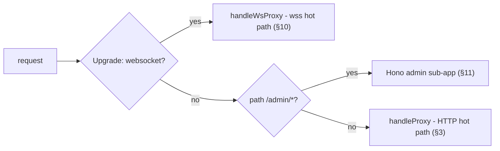
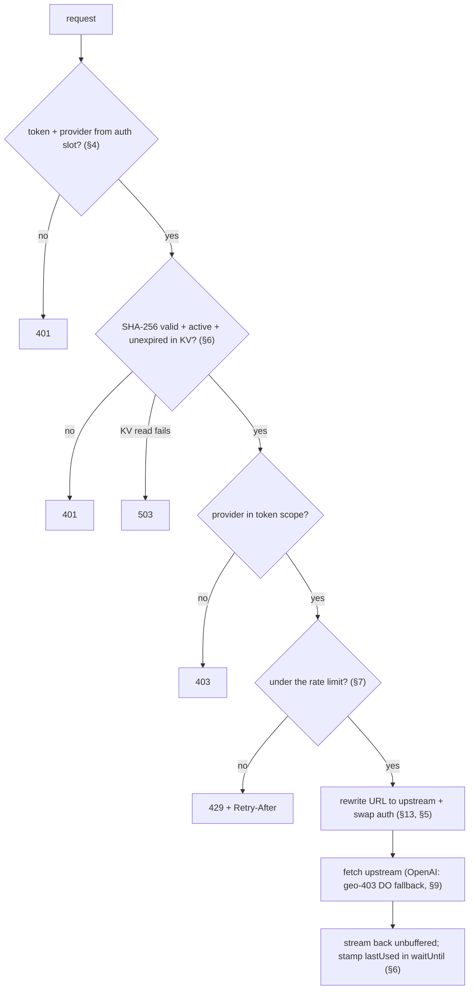
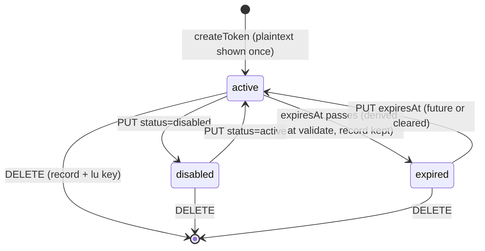
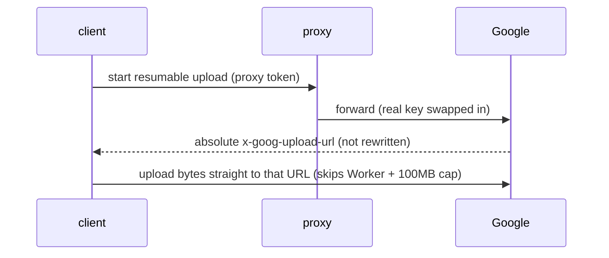

# api-proxy architecture

A Cloudflare Worker that reverse-proxies **OpenAI, Anthropic, and Google Gemini** behind revocable **proxy tokens**. Clients receive no provider key: it is absent from KV and responses, application log statements do not include it, and it is sent only from the Worker or its Durable Object to the selected provider.

This document is the current design. Topic deep-dives with the "why" live in [`docs/learnings/`](learnings/); the retired one-worker-per-provider v1 lives in [`_legacy/v1/`](../_legacy/v1/).

---

## 1. Problem

v1 was three unauthenticated workers (one per provider), each injecting a shared real key for **anyone** who knew the URL - no per-user access, no revocation. v2 collapses them into one token-gated worker.

## 2. Topology

One worker, dispatched in `src/index.ts`:



- The **WebSocket upgrade** is checked first so a realtime client never falls through to the HTTP branch.
- The **admin sub-app** leans on Hono's default error handler (`console.error` + 500), so an admin bug still answers cleanly and never touches the proxy branch.
- The **HTTP hot path** is framework-free; `src/proxy.ts` never imports Hono or admin code.

## 3. Request flow (proxy hot path)

`handleProxy` is a thin wrapper: it answers an `OPTIONS` preflight directly, otherwise runs `proxyRequest` and reflects CORS headers onto the result (§8). `proxyRequest`:

1. **Extract** the token from whichever auth slot it arrived in and **route** the provider from that slot (+ path); missing either → **401**. (§4)
2. **Validate** `SHA-256(token)` against KV - a miss or a disabled token → **401**; an expired one → **401 `token expired`** (distinct message, the most common self-inflicted failure); a KV read failure (outage, exhausted quota) → **503**. (§6)
3. Requested provider not in the token's scope → **403**. (§4)
4. **Rate-limit** on the hash - over the cap → **429** + `Retry-After` (fail-open). (§7)
5. **Rewrite** the URL to the upstream - protocol/host/port only. (§13)
6. **Swap auth** - strip every HTTP header/query auth slot through `stripAuthSlots`, then set one provider key. (§5)
7. **Fetch** the upstream (OpenAI adds a geo-403 fallback, §9), stream the response, and stamp `lastUsed` fire-and-forget. (§6)

Steps 2-4 are one shared `authorize()` call - the same spine the WS path runs (§10), so a new check lands in both pipelines by construction. Infrastructure failures log their cause (`console.error`/`warn`) for §13's Workers Logs; auth rejections (401/403/429) deliberately do not - logging every stranger's bad token would let unauthenticated spam burn the log quota.



## 4. Provider routing (by auth slot)

The client adds no path prefix and no custom header - routing reads **which auth slot the SDK populated** (`identify`):

| Inbound signal | Provider | Upstream |
|---|---|---|
| `x-api-key` | `anthropic` | api.anthropic.com |
| `x-goog-api-key` or `?key=` | `gemini` | generativelanguage.googleapis.com |
| `Authorization: Bearer` + path `/v1beta/openai/*` | `gemini-openai` | generativelanguage.googleapis.com |
| `Authorization: Bearer` (else) | `openai` | api.openai.com |
| none | - | 401 |

Auth slots are checked **before** `?key=`, so a request carrying `Authorization: Bearer` routes to openai / gemini-openai even when it also has `?key=`; the `x-goog-api-key or ?key=` equivalence holds only when no Bearer header is present.

`gemini-openai` (the OpenAI-compatible Gemini endpoint) collapses to the `gemini` scope via `coarse()`; the distinction only selects the auth-swap branch. Why no path prefix: [`provider-routing-by-auth-header.md`](learnings/provider-routing-by-auth-header.md).

## 5. Auth swap (security linchpin)

Before forwarding HTTP, `swapAuth` deletes every header/query auth slot and sets one provider credential:

```ts
stripAuthSlots(headers, url); // shared HTTP/header-query slot list
switch (provider) {
  case "openai": case "gemini-openai": headers.set("authorization", `Bearer ${realKey}`); break;
  case "anthropic":                    headers.set("x-api-key", realKey);                  break;
  case "gemini":                       headers.set("x-goog-api-key", realKey);             break;
}
```

Strip-all-then-set-one prevents dual-slot leaks: `?key=` is deleted for every provider, not only Gemini. `stripAuthSlots` owns the HTTP header/query list and is reused by WebSocket handling; `ws.ts` additionally removes OpenAI's key-bearing subprotocol entry. Tests scan outbound headers and URLs for the proxy token. See [`proxy-token-security.md`](learnings/proxy-token-security.md).

## 6. Token model & lifecycle

KV namespace `TOKENS`, keyed by `SHA-256(token)` (hex). The plaintext is shown **once** at creation and never persisted (`src/tokens.ts`, `src/types.ts`):

```ts
type TokenMetadata = {
  label: string;
  last4: string;                                   // for display
  providers: ("openai"|"anthropic"|"gemini")[];    // coarse scope
  status: "active" | "disabled";
  createdAt: string;                               // ISO
  expiresAt?: string;                              // ISO (UTC); absent = never expires
};
```

- **Tokens** are opaque: `ptk_` + 32 url-safe chars (24 random bytes). Custom admin-typed tokens are allowed; validation is by hash of the full string.
- **Validation** (`getValidatedByHash`): returns the record only if `status === "active"` AND, when `expiresAt` is set, it parses to a future timestamp - malformed or past expiry is rejected **fail-closed**. Not KV `expirationTtl` - why: [`token-expiry-check-at-validate.md`](learnings/token-expiry-check-at-validate.md).
- **`lastUsed`** is a separate `<hash>:lu` key. The first qualifying use per token/day/isolate schedules a stamp: either an authorized HTTP request that receives any upstream response or a successful WebSocket upgrade. The dashboard localizes the stored ISO timestamp. See [`proxy-token-security.md`](learnings/proxy-token-security.md) and [`kv-free-tier-write-quota.md`](learnings/kv-free-tier-write-quota.md).
- **Lifecycle:** admin creation uses `mintToken` + `TokenWriter.create`; `listTokens` performs one `kv.list` page plus batched multi-key reads; `TokenWriter.patch`/`.remove` handle status, expiry, and deletion (record + `:lu`). Changes can take 60 seconds or more to become visible in other locations.



## 7. Per-token rate limiting

After validation, `RATE_LIMITER.limit({ key: hash })` (the Workers Rate Limiting binding) caps each token. Over the limit → `429` + `Retry-After: 60`. Wrapped in try/catch and **fail-open**: a missing or erroring binding must never brick the proxy.

```toml
[[ratelimits]]
name = "RATE_LIMITER"
namespace_id = "1001"

  [ratelimits.simple]
  limit = 100        # one shared ceiling for all tokens; tune freely
  period = 60        # must be 10 or 60
```

It is in-process (not a subrequest), keyed on the hash, and **per-location + eventually consistent** - a loose ceiling for abuse protection, not a strict quota. Verified to run on the Free plan. `/admin/login` throttling is a separate, tighter `LOGIN_LIMITER` ruleset (§11, §13), so tuning the proxy ceiling never loosens brute-force protection. See [`rate-limit-binding-free-and-loose.md`](learnings/rate-limit-binding-free-and-loose.md).

## 8. CORS & browser support

`handleProxy` answers `OPTIONS` with `204` **before** token checks because preflight omits credential headers (why: [`cors-preflight-and-upload-passthrough.md`](learnings/cors-preflight-and-upload-passthrough.md)). The URL remains intact, so Gemini's `?key=` may still be present, but the Worker neither validates nor forwards it. The response reflects `Origin` and requested headers, allows `GET, POST, PUT, DELETE, OPTIONS`, and sets `Access-Control-Max-Age: 86400`. An actual cross-origin request runs normal authorization and its outbound provider request carries the real provider key. `withCors` only adds response headers: reflected origin, `Vary: Origin`, and exposed Gemini upload headers. No `Origin` means no CORS headers; cookie credentials are not enabled.

**Gemini file uploads:** the authenticated start call crosses the proxy. Google returns an absolute, self-authenticating `x-goog-upload-url`, then the client uploads bytes directly to Google. That second leg avoids the Worker's 100 MB body cap and carries no provider key.



## 9. OpenAI geo-403 egress (US-jurisdiction Durable Object)

OpenAI 403s `unsupported_country_region_territory` when a request egresses from an unsupported colo (e.g. Hong Kong). A Worker's `fetch()` egresses from the colo the invocation runs in, fixed per invocation, so an in-invocation retry can't escape a bad colo.

The proxy tries the direct edge `fetch()` first and, **only on that geo-403**, reissues the request through `env.US_EGRESS.jurisdiction("us")`. This is a US jurisdiction constraint, not a best-effort `locationHint`. Only OpenAI bodies are buffered for replay; eight named objects (`oa-egress-<N>`) spread fallback traffic. The provider key traverses Cloudflare's Worker/DO path and is then sent to OpenAI, never to a third-party relay. Evidence and tradeoffs: [`openai-egress-geo-block.md`](learnings/openai-egress-geo-block.md).

## 10. WebSocket (wss) proxying

`handleWsProxy` is dispatched before HTTP on `Upgrade: websocket`. The tested endpoints are **OpenAI** `/v1/realtime` and `/v1/responses`, plus **Gemini Live** (`...BidiGenerateContent`). An `x-api-key` upgrade is also identified and forwarded as Anthropic, so the handler does not exclude that provider.

The flow reuses `authorize()`, then opens the upstream with `fetch()` plus `Upgrade: websocket`, reads `resp.webSocket`, and pumps frames through a `WebSocketPair`. `fetch()` remains deliberate even though Workers now provide `new WebSocket()`: fetched sockets can opt into `accept({ allowHalfOpen: true })`, which the proxy needs to coordinate close frames. The manual pipe also echoes the negotiated subprotocol. A refused upgrade is returned verbatim.

**Auth on a WS handshake has a wider slot set than HTTP** (why: [`websocket-proxy-auth-slots.md`](learnings/websocket-proxy-auth-slots.md)):

| Inbound slot | Provider | Swapped to (upstream) |
|---|---|---|
| `Authorization: Bearer <token>` | openai or gemini-openai by path | `Authorization: Bearer <real>` |
| `x-api-key: <token>` | anthropic | `x-api-key: <real>` |
| `Sec-WebSocket-Protocol: openai-insecure-api-key.<token>` | openai | key entry dropped; real key set as `Authorization: Bearer` (the worker *can* set headers); `realtime` + org/project/beta subprotocols kept |
| `?key=<token>` | gemini | `?key=<real>` in the query (Gemini Live reads the key there, not a header) |

`prepareWsUpstream` applies the shared HTTP header/query stripping, removes OpenAI's key-bearing subprotocol entry, and sets one upstream credential. The OpenAI geo-403 fallback applies to upgrades too.

Caveats: the rate limit gates the **connection**, not each frame, and revocation affects the next connection rather than an already-authorized socket. See [`websocket-proxy-auth-slots.md`](learnings/websocket-proxy-auth-slots.md).

## 11. Admin dashboard

Embedded **Hono** sub-app at `/admin` (`src/admin/`), server-rendered HTML via `hono/html` plus **HTMX 2.x** loaded from a CDN with a pinned version **and an SRI hash** (`integrity` + `crossorigin`): the page holds token-mint power and receives `ADMIN_SECRET`, so a tampered CDN response must refuse to execute. No authored client JS beyond a handful of inline `hx-on` attributes; nothing in the worker bundle but markup + attributes. The login form also carries `method="post"` so a no-htmx fallback submit can never default to GET and leak the password into the URL.

- **Auth:** one `ADMIN_SECRET` password. `POST /admin/login` is rate-limited per client IP (dedicated `LOGIN_LIMITER`, 10/60s, fail-open) and compared in constant time (hono's `timingSafeEqual`, which hashes both sides with SHA-256); failures are logged. Success sets a signed cookie via `hono/cookie` (`setSignedCookie`: HMAC-SHA-256 over the issue timestamp, `Path=/admin; HttpOnly; Secure; SameSite=Strict; Max-Age=86400`). A middleware guards every `/admin/*` route except login; `getSignedCookie` verifies in constant time (`crypto.subtle.verify`) and the guard re-checks the 24h age server-side, so a client ignoring `Max-Age` gains nothing. Tampered/expired cookies are pinned by negative-path tests.
- **CRUD:** `GET`, `POST`, `PUT`, and `DELETE` under `/admin/api/tokens`. Hash params must be 64-hex; provider scope and status are whitelisted; custom tokens need at least 12 characters. `PUT` patches status and/or expiry - a blank expiry clears it (never expires). Creation, patches, and deletes are serialized through a per-hash `TokenWriter` Durable Object whose own storage is the merge base (KV guarantees neither atomic read-modify-write nor read-your-write, so merging from a KV read let a stale expiry patch resurrect a disabled token); KV is written through for the hot path, only pre-writer hashes bootstrap from a KV read, a deletion tombstone blocks stale echoes, and recreation clears it. Creation checks for an existing hash and returns 409, but KV offers no transaction across that read and write, so concurrent identical creations are not an atomic uniqueness guarantee.
- **UI:** creation returns the plaintext once, base URLs, and an out-of-band row; `PUT` returns a replacement row; `DELETE` returns an empty 200 body. The table localizes expiry and `lastUsed`, marks expired rows, edits expiry in place (click or focus+Enter on the cell, pick a local datetime, saved as UTC ISO exactly as picked - a past pick renders as an expired row immediately; the poll pauses while an editor is focused), loads immediately, and refreshes every 120 seconds while visible. Polls and mutations share the persistent `#tokens` sync scope; in-flight rows dim but stay clickable so same-row gestures reach the writer. A different row's mutation can abort the earlier row swap, leaving that cell stale until the next poll. The immediate POST row avoids waiting for KV propagation, which can take 60 seconds or more in other locations.
- **Errors surface:** a body-level `hx-on::response-error` writes failures into a flash div (htmx swaps nothing on non-2xx by default - previously a wrong password or an expired session silently no-opped), and a 401 mid-session bounces back to the login page.

## 12. Real key handling

`OPENAI_API_KEY`, `ANTHROPIC_API_KEY`, `GEMINI_API_KEY`, and `ADMIN_SECRET` are Cloudflare secrets. Provider keys are read only after authorization, injected into the outbound provider request, not stored in KV or returned to clients, and omitted by the application's own log statements. Preflight and rejected requests never read them; an authorized cross-origin request does.

## 13. Storage, bindings & config (`wrangler.toml`)

| Binding | Kind | Purpose |
|---|---|---|
| `TOKENS` | KV namespace | token store (by `SHA-256`) + `:lu` last-used keys |
| `US_EGRESS` | SQLite Durable Object (`UsEgress`) | US-jurisdiction egress fallback for OpenAI (HTTP + wss) |
| `TOKEN_WRITER` | SQLite Durable Object (`TokenWriter`) | serializes admin token writes (KV has no atomic read-modify-write) |
| `RATE_LIMITER` | Rate Limit | per-token RPM ceiling (100/60s) |
| `LOGIN_LIMITER` | Rate Limit | per-IP `/admin/login` throttle (10/60s, separate ruleset) |

Plus migrations `v1` (`UsEgress`) and `v2` (`TokenWriter`). Upstreams resolve through `upstreamBase()`: the `*_UPSTREAM` env vars (plain vars, not secrets) default to the real hosts and are overridden only by tests pointing at a mock; `rewriteToUpstream` rewrites just protocol/host/port.

`[observability] enabled = true` persists `console.*` to Workers Logs. Infrastructure failures log their cause: KV reads, upstream fetches, geo-403 fallback, admin errors, failed logins, and `lastUsed` writes. Auth rejections and fail-open limiter errors stay unlogged to avoid request-driven log volume.

## 14. Testing (two tiers)

| Tier | Runner | Scope |
|---|---|---|
| 1 - proxy logic | `@cloudflare/vitest-pool-workers` (workerd) | routing, auth swap, expiry, CORS, rate limit, geo-403 fallback, SSE passthrough, **WS upgrade + subprotocol auth swap** (`test/ws.test.ts`); mocks `fetch`, seeds KV directly |
| 2 - real clients | `unstable_startWorker` + local `node:http` mock | official SDKs, Vercel AI SDK, LangChain, Genkit, LiteLLM, LlamaIndex, instructor, Pydantic AI, raw fetch, and a real `ws` round-trip |

Each Node compatibility file owns an ephemeral worker (`persist: false`) and mock; Vitest file parallelism remains enabled. The Python runner exercises its four clients serially against one ephemeral worker. Auth slots prove routing, while distinct clients catch base-URL conventions, endpoint defaults, generated headers, transport choices, and stream parsing. Every current compatibility client therefore remains in scope. No automated case hits a live provider. See [`compat-is-the-auth-slot-not-the-sdk.md`](learnings/compat-is-the-auth-slot-not-the-sdk.md).

## 15. Deployment

```bash
nub install
nubx wrangler kv namespace create api-proxy-tokens   # paste id into wrangler.toml
nubx wrangler secret put OPENAI_API_KEY              # + ANTHROPIC / GEMINI / ADMIN_SECRET
nubx wrangler deploy
```

See the README's [cost note](../README.md#cost): OpenAI fallbacks and admin token mutations consume Durable Object request and duration allowance as well as the Worker request.

## 16. Security model

Invariants are detailed in §5 (auth swap), §6 (token hashing, revoke-safe `lastUsed`), §11 (admin HMAC cookie), and §12 (real-key handling).

Caveats:

- KV-backed create, revoke, status, and expiry changes can take 60 seconds or more to appear in another location; rotate the provider credential when a provider-wide cutoff cannot wait for KV propagation.
- Do not host on `*.openai.azure.com` / `*.cognitiveservices.azure.com` (the OpenAI SDK switches to Azure auth on those hostnames).
