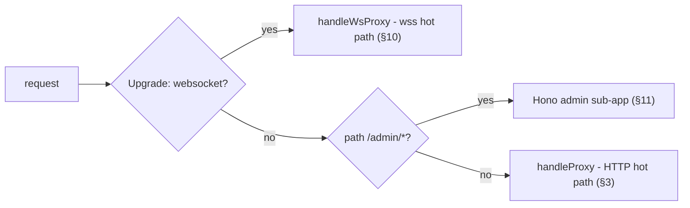
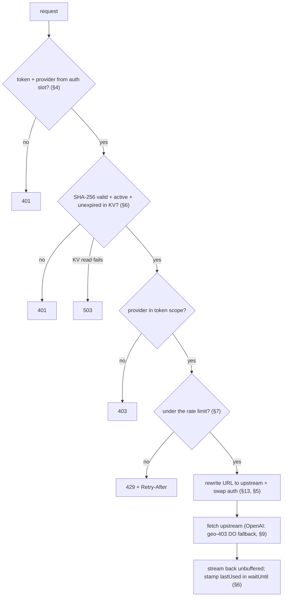
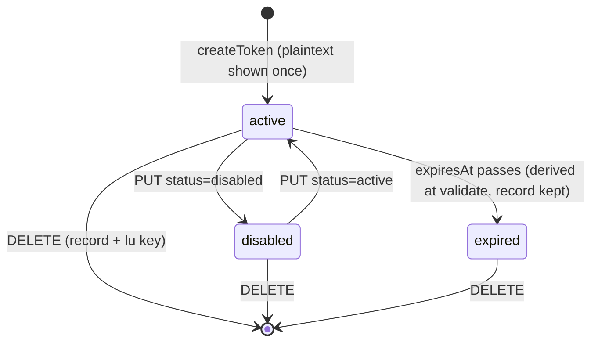
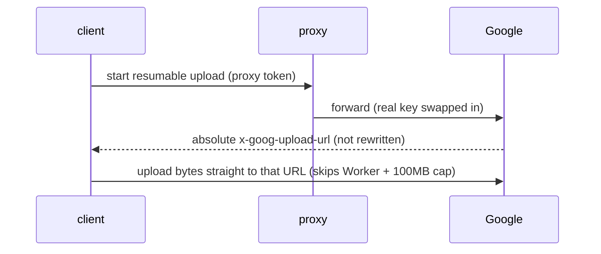
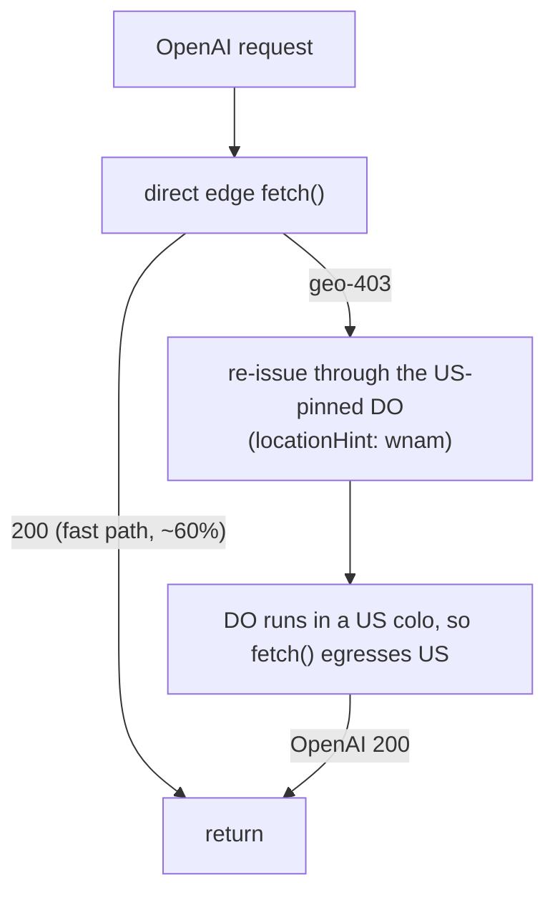
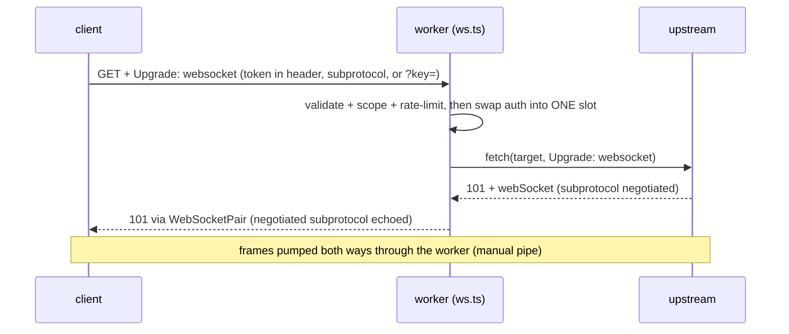

# api-proxy architecture

A single Cloudflare Worker (Free plan) that reverse-proxies **OpenAI, Anthropic, and Google Gemini** behind shareable, revocable **proxy tokens**. A client changes only its base URL and API key; the worker validates the token, swaps in the real provider key server-side, and forwards the request verbatim. The real key never leaves Cloudflare.

This document is the current design. Topic deep-dives with the "why" live in [`docs/learnings/`](learnings/); the retired one-worker-per-provider v1 lives in [`_legacy/v1/`](../_legacy/v1/).

---

## 1. Problem

v1 was three unauthenticated workers (one per provider), each injecting a shared real key for **anyone** who knew the URL - no per-user access, no revocation. v2 collapses them into one token-gated worker.

## 2. Topology

One worker, dispatched in `src/index.ts`:



- The **WebSocket upgrade** is checked first so a realtime client never falls through to the HTTP branch.
- The **admin sub-app** leans on Hono's default error handler (`console.error` + 500), so an admin bug still answers cleanly and never touches the proxy branch.
- The **HTTP hot path** is framework-free (`src/proxy.ts` must never import Hono - it is pure functions plus a `fetch` handler).

## 3. Request flow (proxy hot path)

`handleProxy` is a thin wrapper: it answers an `OPTIONS` preflight directly, otherwise runs `proxyRequest` and reflects CORS headers onto the result (§8). `proxyRequest`:

1. **Extract** the token from whichever auth slot it arrived in and **route** the provider from that slot (+ path); missing either → **401**. (§4)
2. **Validate** `SHA-256(token)` against KV - a miss or a disabled token → **401**; an expired one → **401 `token expired`** (distinct message, the most common self-inflicted failure); a KV read failure (outage, exhausted quota) → **503**. (§6)
3. Requested provider not in the token's scope → **403**. (§4)
4. **Rate-limit** on the hash - over the cap → **429** + `Retry-After` (fail-open). (§7)
5. **Rewrite** the URL to the upstream - protocol/host/port only. (§13)
6. **Swap auth** - strip every inbound auth slot (the headers *and* `?key=`, one shared owner: `stripAuthSlots`), set the one real key. (§5)
7. **Fetch** the upstream (OpenAI adds a geo-403 fallback, §9), stream the response back unbuffered, and stamp `lastUsed` fire-and-forget. (§6, §9)

Steps 2-4 are one shared `authorize()` call - the same spine the WS path runs (§10), so a new check lands in both pipelines by construction. Infrastructure failures log their cause (`console.error`/`warn`) for §13's Workers Logs; auth rejections (401/403/429) deliberately do not - logging every stranger's bad token would let unauthenticated spam burn the log quota.



## 4. Provider routing (by auth header)

The client adds no path prefix and no custom header - routing reads **which auth slot the SDK populated** (`identify`):

| Inbound signal | Provider | Upstream |
|---|---|---|
| `x-api-key` | `anthropic` | api.anthropic.com |
| `x-goog-api-key` or `?key=` | `gemini` | generativelanguage.googleapis.com |
| `Authorization: Bearer` + path `/v1beta/openai/*` | `gemini-openai` | generativelanguage.googleapis.com |
| `Authorization: Bearer` (else) | `openai` | api.openai.com |
| none | - | 401 |

Auth slots are checked **before** `?key=`, so a request carrying `Authorization: Bearer` routes to openai / gemini-openai even when it also has `?key=`; the `x-goog-api-key or ?key=` equivalence holds only when no Bearer header is present.

`gemini-openai` (the OpenAI-compatible Gemini endpoint) collapses to the `gemini` scope via `coarse()`; the distinction only selects the auth-swap branch. Why no path prefix: [`provider-routing-by-auth-header.md`](learnings/provider-routing-by-auth-header.md).

## 5. Auth swap (security linchpin)

Before forwarding, `swapAuth` deletes **every** inbound auth slot and sets exactly one header with the real key:

```ts
stripAuthSlots(headers, url); // x-api-key, x-goog-api-key, authorization, ?key= - the one slot list
switch (provider) {
  case "openai": case "gemini-openai": headers.set("authorization", `Bearer ${realKey}`); break;
  case "anthropic":                    headers.set("x-api-key", realKey);                  break;
  case "gemini":                       headers.set("x-goog-api-key", realKey);             break;
}
```

Strip-all-then-set-one guarantees the proxy token is never forwarded upstream even if a client sends it in an unexpected slot, and closes dual-slot leaks: the `?key=` query slot is deleted for every provider too, not just Gemini. `stripAuthSlots` is the single owner of the slot list, shared with the WS path (§10) - a new auth slot is added in exactly one place. A test scans **every** outbound header entry plus the URL and asserts the token appears nowhere. See [`proxy-token-security.md`](learnings/proxy-token-security.md).

## 6. Token model & lifecycle

KV namespace `TOKENS`, keyed by `SHA-256(token)` (hex). The plaintext is shown **once** at creation and never persisted (`src/tokens.ts`, `src/types.ts`):

```ts
type TokenMetadata = {
  label: string;
  last4: string;                                   // for display
  providers: ("openai"|"anthropic"|"gemini")[];    // coarse scope
  status: "active" | "disabled";
  createdAt: string;                               // ISO
  expiresAt?: string;                              // ISO (UTC); absent = never expires
};
```

- **Tokens** are opaque: `ptk_` + 32 url-safe chars (24 random bytes). Custom admin-typed tokens are allowed; validation is by hash of the full string.
- **Validation** (`getValidatedByHash`): returns the record only if `status === "active"` AND, when `expiresAt` is set, it parses to a future timestamp - malformed or past expiry is rejected **fail-closed**. Not KV `expirationTtl` - why: [`token-expiry-check-at-validate.md`](learnings/token-expiry-check-at-validate.md).
- **`lastUsed`** lives in a separate `<hash>:lu` key, stamped fire-and-forget at most once per UTC day per token **per isolate**. Why the side key: [`proxy-token-security.md`](learnings/proxy-token-security.md); why the once-a-day throttle: [`kv-free-tier-write-quota.md`](learnings/kv-free-tier-write-quota.md).
- **Lifecycle:** `createToken`, `listTokens` (one `kv.list` page, skips `:lu` keys), `updateToken` (status), `deleteToken` (record + `:lu`). KV is eventually consistent (~60s), so revoke and new-token visibility can lag.



## 7. Per-token rate limiting

After validation, `RATE_LIMITER.limit({ key: hash })` (the Workers Rate Limiting binding) caps each token. Over the limit → `429` + `Retry-After: 60`. Wrapped in try/catch and **fail-open**: a missing or erroring binding must never brick the proxy.

```toml
[[ratelimits]]
name = "RATE_LIMITER"
namespace_id = "1001"

  [ratelimits.simple]
  limit = 100        # one shared ceiling for all tokens; tune freely
  period = 60        # must be 10 or 60
```

It is in-process (not a subrequest), keyed on the hash, and **per-colo + eventually consistent** - a loose ceiling for abuse protection, not a strict quota. Verified to run on the Free plan. `/admin/login` throttling is a separate, tighter `LOGIN_LIMITER` ruleset (§11, §13), so tuning the proxy ceiling never loosens brute-force protection. See [`rate-limit-binding-free-and-loose.md`](learnings/rate-limit-binding-free-and-loose.md).

## 8. CORS & browser support

`handleProxy` short-circuits `OPTIONS` to a `204` preflight **before** the token checks (why: [`cors-preflight-and-upload-passthrough.md`](learnings/cors-preflight-and-upload-passthrough.md)). The preflight reflects the request `Origin`, reflects the requested `Access-Control-Request-Headers` (else `*`), advertises a fixed method allow-list (`GET, POST, PUT, DELETE, OPTIONS`), and sets `Access-Control-Max-Age: 86400`. Every real response then passes through `withCors`, which reflects `Origin`, appends `Vary: Origin` (so per-Origin reflection is cache-safe), and exposes the Gemini resumable-upload headers (`x-goog-upload-url, x-goog-upload-status, x-goog-upload-chunk-granularity`). No `Origin` → no CORS headers (server-side callers are unaffected). Credentials mode is never enabled (SDKs send keys as headers, not cookies). Provider browser opt-ins still apply (e.g. Anthropic's `dangerouslyAllowBrowser`, which the SDK forwards as a header).

**Gemini file uploads** pass through verbatim: the start call routes normally, Google returns an absolute, self-authenticating `x-goog-upload-url`, and the client uploads bytes **directly to Google** - that leg never transits the worker, so the 100 MB body cap is sidestepped and the real key is never on it.



## 9. OpenAI geo-403 egress (North-America-pinned Durable Object)

OpenAI 403s `unsupported_country_region_territory` when a request egresses from an unsupported colo (e.g. Hong Kong). A Worker's `fetch()` egresses from the colo the invocation runs in, fixed per invocation, so an in-invocation retry can't escape a bad colo.

The fix is a fallback: try the fast edge `fetch()` first (requests that egress from a good colo return immediately); **only on the geo-403**, re-issue the same request through the `UsEgress` SQLite Durable Object pinned to North America (`locationHint: "wnam"`). Running in a US colo, its `fetch()` egresses from a supported region and succeeds. Only the OpenAI branch buffers the body (to replay it to the DO); a pool of 8 named DO ids (`oa-egress-<N>`, picked at random) spreads load. Anthropic and Gemini are untouched, and the real key never leaves Cloudflare. Discovery story + dead ends: [`openai-egress-geo-block.md`](learnings/openai-egress-geo-block.md).



## 10. WebSocket (wss) proxying

The token-swap model extends to WebSocket upgrades (`src/ws.ts`, `handleWsProxy`), dispatched before the HTTP branch on `Upgrade: websocket`. It serves the realtime/streaming sockets the HTTP APIs don't cover: **OpenAI** `/v1/realtime` and `/v1/responses` (WebSocket mode), and **Gemini Live** (`...BidiGenerateContent`). Anthropic has no wss API (Messages is SSE-over-HTTP only), so it is naturally excluded.

The flow mirrors the HTTP path - extract token → validate hash → scope check → rate-limit → swap auth - then opens the upstream socket with `fetch(target, { Upgrade: websocket })` (the scheme stays `http(s):`; the header drives the upgrade), reads `resp.webSocket`, and pumps frames both ways through a `WebSocketPair`. It's a **manual pipe** (not a transparent pass-through) so the subprotocol the upstream negotiates is echoed back to the client deterministically. A non-101 upstream handshake (401/403/426) is surfaced to the client verbatim rather than as a generic error.



**Auth on a WS handshake has a wider slot set than HTTP** (why: [`websocket-proxy-auth-slots.md`](learnings/websocket-proxy-auth-slots.md)):

| Inbound slot | Provider | Swapped to (upstream) |
|---|---|---|
| `Authorization: Bearer <token>` | openai | `Authorization: Bearer <real>` |
| `Sec-WebSocket-Protocol: openai-insecure-api-key.<token>` | openai | key entry dropped; real key set as `Authorization: Bearer` (the worker *can* set headers); `realtime` + org/project/beta subprotocols kept |
| `?key=<token>` | gemini | `?key=<real>` in the query (Gemini Live reads the key there, not a header) |

The upgrade runs the same shared `authorize()` spine as HTTP (§3), and `prepareWsUpstream` strips every inbound auth slot via the shared `stripAuthSlots` (§5) then sets exactly one in the shape this provider's WS API expects - so the proxy token never reaches the upstream in any slot (header, query, or subprotocol); a test asserts this. The OpenAI **geo-403 fallback (§9) applies here too**: a 403 from a bad colo re-issues the upgrade through the `UsEgress` DO, which carries a WebSocket like a plain `fetch`.

Caveats: the rate limit gates the **connection**, not each frame (one upgrade = one hit); a revoke takes effect on the next connection, not mid-stream (a long-lived socket is validated once, at upgrade time); and Cloudflare closes an idle socket after a quiet period, so a silent client should keep-alive. See [`websocket-proxy-auth-slots.md`](learnings/websocket-proxy-auth-slots.md).

## 11. Admin dashboard

Embedded **Hono** sub-app at `/admin` (`src/admin/`), server-rendered HTML via `hono/html` plus **HTMX 2.x** loaded from a CDN with a pinned version **and an SRI hash** (`integrity` + `crossorigin`): the page holds token-mint power and receives `ADMIN_SECRET`, so a tampered CDN response must refuse to execute. No authored client JS beyond a handful of inline `hx-on` attributes; nothing in the worker bundle but markup + attributes. The login form also carries `method="post"` so a no-htmx fallback submit can never default to GET and leak the password into the URL.

- **Auth:** one `ADMIN_SECRET` password. `POST /admin/login` is rate-limited per client IP (dedicated `LOGIN_LIMITER`, 10/60s, fail-open) and compared in constant time (hono's `timingSafeEqual`, which hashes both sides with SHA-256); failures are logged. Success sets a signed cookie via `hono/cookie` (`setSignedCookie`: HMAC-SHA-256 over the issue timestamp, `Path=/admin; HttpOnly; Secure; SameSite=Strict; Max-Age=86400`). A middleware guards every `/admin/*` route except login; `getSignedCookie` verifies in constant time (`crypto.subtle.verify`) and the guard re-checks the 24h age server-side, so a client ignoring `Max-Age` gains nothing. Tampered/expired cookies are pinned by negative-path tests.
- **CRUD:** HTMX-driven over `/admin/api/tokens` - list (`GET`), create (`POST`; parses label, provider checkboxes, an optional `datetime-local` expiry the form converts to UTC ISO in the browser, custom-or-generated token), enable-disable (`PUT`, status only), delete (`DELETE`). `:hash` params are validated as 64-hex. Guards: no providers → 400 (no silent openai default), custom tokens need ≥ 12 chars, creating over an existing hash → 409 (an overwrite could resurrect a disabled token), and `status` is whitelisted (a malformed value must not re-enable a token).
- **UI:** an add-token card (label, token, **Expires (optional)**, provider checkboxes) and a token table (label, last-4, provider pills, status, **Expires**, last-used, disable/delete). The created plaintext is shown once as a **click-to-copy value with the per-provider base URLs** ready to hand out; expired tokens render `expired` and dim the row. Mutations render their own rows (the POST response carries the new row out-of-band), since `kv.list()` lags writes by up to 60 s; the list refreshes on load and **every 120 s while the tab is visible** - each refresh costs a `kv.list`, and the free tier's 1,000 lists/day (account-wide) rules out tighter polling.
- **Errors surface:** a body-level `hx-on::response-error` writes failures into a flash div (htmx swaps nothing on non-2xx by default - previously a wrong password or an expired session silently no-opped), and a 401 mid-session bounces back to the login page.

## 12. Real key handling

`OPENAI_API_KEY`, `ANTHROPIC_API_KEY`, `GEMINI_API_KEY`, `ADMIN_SECRET` are Cloudflare **secrets**, read at request time and injected only into the outbound request. Never logged, never stored in KV, never returned in a response body. The CORS and rate-limit paths never touch a real key.

## 13. Storage, bindings & config (`wrangler.toml`)

| Binding | Kind | Purpose |
|---|---|---|
| `TOKENS` | KV namespace | token store (by `SHA-256`) + `:lu` last-used keys |
| `US_EGRESS` | SQLite Durable Object (`UsEgress`) | NA-pinned egress fallback for OpenAI (HTTP + wss) |
| `RATE_LIMITER` | Rate Limit | per-token RPM ceiling (100/60s) |
| `LOGIN_LIMITER` | Rate Limit | per-IP `/admin/login` throttle (10/60s, separate ruleset) |

Plus `[[migrations]] tag="v1" new_sqlite_classes=["UsEgress"]`. Upstreams resolve through `upstreamBase()`: the `*_UPSTREAM` env vars (plain vars, not secrets) default to the real hosts and are overridden only by tests pointing at a mock; `rewriteToUpstream` rewrites just protocol/host/port.

`[observability] enabled = true` persists `console.*` to Workers Logs (free plan: 200k events/day, 3-day retention - never a charge). The infrastructure failure paths log their cause - KV outage, upstream fetch failure, geo-403 fallback firing, admin route errors, failed logins, failed `lastUsed` stamps - so a 2am incident is diagnosable from the dashboard, not just a live `wrangler tail`. Deliberately unlogged: auth rejections (flood-safe, see §3) and the fail-open rate-limiter catch (a missing binding would warn on every request in dev).

## 14. Testing (two tiers)

| Tier | Runner | Scope |
|---|---|---|
| 1 - proxy logic | `@cloudflare/vitest-pool-workers` (workerd) | routing, auth swap, expiry, CORS, rate limit, geo-403 fallback, SSE passthrough, **WS upgrade + subprotocol auth swap** (`test/ws.test.ts`); mocks `fetch`, seeds KV directly |
| 2 - real client libs | `unstable_dev` worker + `node:http` mock upstream (Node via vitest; Python via `test/run-py.mjs`) | official `openai`/`@anthropic-ai/sdk`/`@google/genai` SDKs, Vercel AI SDK, LangChain, Genkit (`@genkit-ai/google-genai`), LiteLLM, LlamaIndex, instructor, Pydantic AI, and a **real wss round-trip** (`websocket.ts`: `ws` client → worker → `ws` mock) - end-to-end |

Tier 2 covers every auth slot - OpenAI (`Bearer`, `openai.ts` + `litellm.py`), Anthropic (`x-api-key`, `anthropic-ai-sdk.ts`), Gemini native (`x-goog-api-key`, `google-genai.ts`), Gemini OpenAI-compat (the OpenAI SDK at `/v1beta/openai`, `google-genai.ts`), and the Gemini `?key=` query slot plus verbatim path/query/body forwarding (`fetch.ts`) - plus streaming for the main three; OpenAI-compat streaming rides the same SSE passthrough, so it has no dedicated test. Each asserts the real key reaches the mock and the token never does. Compatibility is fixed by the **auth slot, not the SDK or language**, so each distinct library gets **one** end-to-end test in one language; everything else (other-language packages, end-user apps, JVM/.NET frameworks) reuses a proven slot and is documented rather than re-tested - see [`compat-is-the-auth-slot-not-the-sdk.md`](learnings/compat-is-the-auth-slot-not-the-sdk.md). **No test hits a live provider** (mock upstream only): OpenAI (HTTP and wss Realtime/Responses, both WS auth slots) and Anthropic are verified live in deployment, but **Gemini has never run against the real Google API** (no key yet).

## 15. Deployment

```bash
nub install
nubx wrangler kv namespace create api-proxy-tokens   # paste id into wrangler.toml
nubx wrangler secret put OPENAI_API_KEY              # + ANTHROPIC / GEMINI / ADMIN_SECRET
nubx wrangler deploy
```

Free Workers plan covers it (100k req/day); you only pay upstream providers for usage.

## 16. Security model

Invariants are detailed in §5 (auth swap), §6 (token hashing, revoke-safe `lastUsed`), §11 (admin HMAC cookie), and §12 (real-key handling).

Caveats:

- A revoke / expiry-flip is not instant (§6: KV lags ~60s) - for an immediate cutoff, rotate the provider secret (instant, and the key stays in Cloudflare).
- Do not host on `*.openai.azure.com` / `*.cognitiveservices.azure.com` (the OpenAI SDK switches to Azure auth on those hostnames).

## 17. Deferred / future

The token data model leaves room (`limits`, `spend`) without carrying the weight now: spend / token-count caps + per-token usage analytics (needs a metering Durable Object and SSE usage parsing), multiple real keys per provider (key pools), concurrency limits and longer rate-limit windows, and instant (sub-minute) revocation via a DO allow/deny list.
