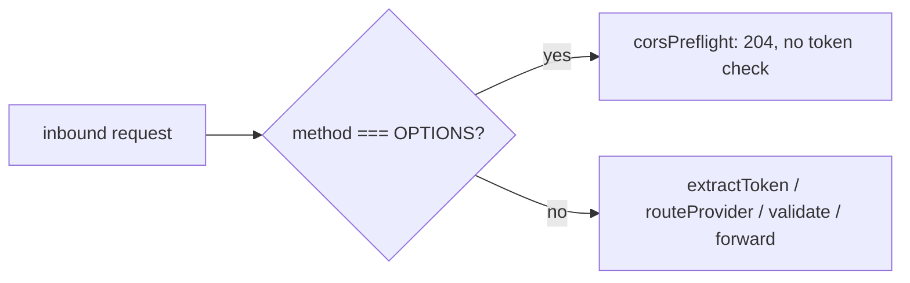
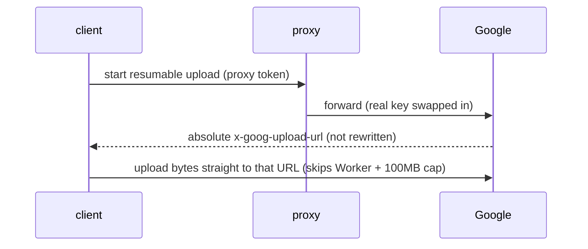

# CORS preflight and upload passthrough

Two browser-facing quirks from v2.1, both about what the proxy must *not* touch.

## A. CORS preflight must run before token auth

### Problem

Browser SDK callers trigger a CORS preflight: the browser sends an `OPTIONS` request *first*, and that preflight carries **no auth header** (no `x-api-key`, no `Authorization`, no `?key=`). Run auth first and `extractToken`/`routeProvider` see nothing, so every preflight 401s - the browser then never fires the real request. All browser SDK callers break silently.

### What we found

`handleProxy` short-circuits `OPTIONS` to a `204` **before** any token work (`src/proxy.ts`, the `if (req.method === "OPTIONS")` at the top, ahead of `proxyRequest`):

The `204` reflects the caller's `Origin` and echoes the requested headers back (`access-control-allow-headers` = the inbound `access-control-request-headers`, else `*`). `withCors` also `append`s `Vary: Origin` to every response so caches don't mix per-origin replies.

### Decision we keep

Preflight is answered before auth, and the real key never rides any CORS path (`withCors`/`corsPreflight` only set `access-control-*` and `Vary`). Auth-first would be the natural instinct and it is wrong here.

## B. Gemini resumable-upload URL is passed through, not rewritten

### Problem

Gemini's resumable upload returns an **absolute** `x-goog-upload-url` pointing straight at Google. If the proxy tried to own that flow, large uploads would hit the Worker's 100MB request-body cap.

### What we found

`rewriteToUpstream` (`src/upstreams.ts`) only swaps `protocol`/`hostname`/`port` on the *request* URL - it never rewrites the absolute `x-goog-upload-url` Google returns. So the client uploads bytes **directly to Google**, bypassing the Worker and its body cap. The proxy's only job is to let the browser *read* that header: `withCors` sets `access-control-expose-headers` to the `EXPOSE_HEADERS` constant (`x-goog-upload-url, x-goog-upload-status, x-goog-upload-chunk-granularity`).

### Decision we keep

Pass the upload URL through untouched; only expose the headers. This is also **why a path-prefix routing scheme would break Gemini** - the absolute upload URL can't carry a `/gemini/` prefix - which is the upload half of the case in [provider-routing-by-auth-header.md](provider-routing-by-auth-header.md). Token security on the normal path is unchanged (see [proxy-token-security.md](proxy-token-security.md)).
