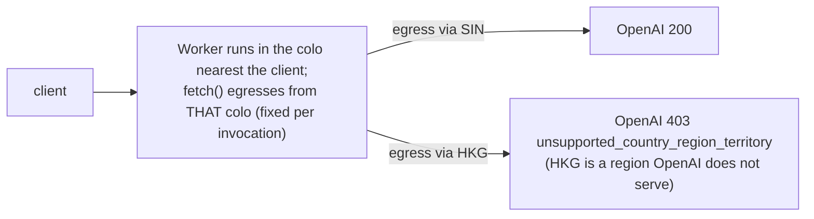

# OpenAI egress geo-block

## Problem

Through the Worker, OpenAI 403'd `unsupported_country_region_territory` on ~40% of requests. Valid key, correct path, correct auth. Anthropic was always fine.

## What we found

- Single probes all succeeded; only hammering exposed the ~40% failure. It correlated **100%** with the egress colo: **HKG → 403, SIN → 200**. OpenAI's country geo-restriction (HKG/CN unsupported), not an IP or bot block. Anthropic doesn't geo-block those regions.
- Six sequential subrequests inside one invocation always hit the same colo - the evidence that the egress colo only re-rolls across invocations, so no in-invocation retry can help.

**What does NOT fix it:**

- **Smart Placement / `placement.region`**: optimize *execution* for *latency*, not egress country; can leave a Worker in HKG, and may not relocate a single-subrequest proxy at all. Community reports confirm.
- **Dedicated Egress IPs / Regional Services**: would work, paid/Enterprise only.
- **A third-party relay** (Vercel, VPS): works, but routes the real key through another host - rejected on the "key never leaves Cloudflare" rule.

## The decision we keep

A North-America-pinned Durable Object as a **fallback, not the default path** (mechanics + flow diagram: architecture §9). Why this shape: key never leaves Cloudflare, free (SQLite DO), good-colo calls stay fast, other providers untouched. Post-fix stress test: 25/25 `200`, DO egress verified US (DFW/LAX/DEN/SJC/SEA), streaming survives. Another provider showing the same geo-403 → extend the `coarse(provider) === "openai"` branch.
