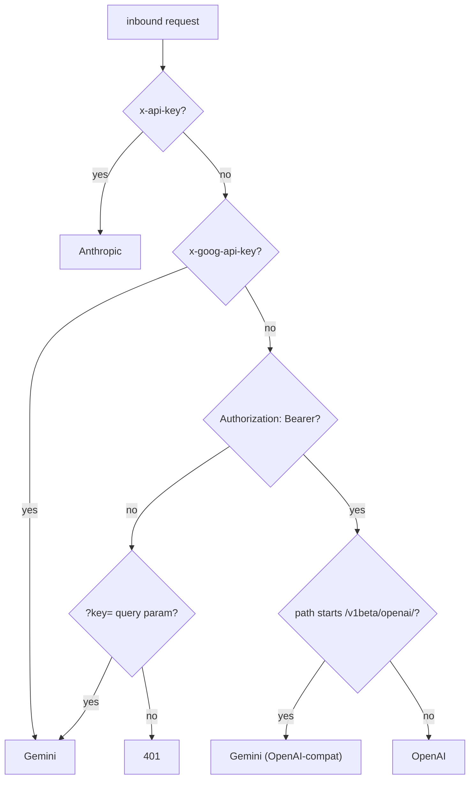

# Provider routing by auth header

## Problem

One consolidated base URL has to transparently serve OpenAI, Anthropic, and Gemini. The goal: a client changes only its base URL and API key, nothing else. So the proxy must decide which upstream a request is for without the client adding a path prefix or custom header.

## What we found

Each SDK already announces its provider by *which auth slot it populates* - no path prefix or custom header needed. The slot-to-provider mapping lives in architecture §4; the check order matters and is (`src/proxy.ts` `routeProvider`):

**Why not a path prefix** (e.g. `/openai/...`):

- It would break Gemini, whose file-upload flow returns absolute `x-goog-upload-url` paths the client then calls directly; a prefix scheme can't survive that round trip.
- It would force every client to rewrite the SDK's own base path, defeating the "change only base URL + key" promise.

## The decision we keep

Route by auth slot, keeping each SDK's native path intact - a true drop-in. The token is extracted from the same slot; the swap is [proxy-token-security.md](proxy-token-security.md)'s territory.
