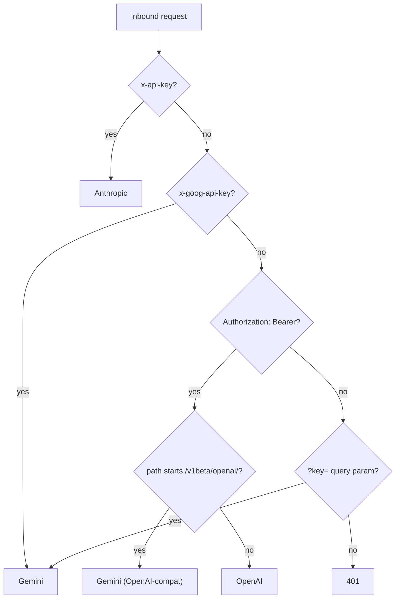

# Provider routing by auth header

## Problem

One consolidated base URL has to transparently serve OpenAI, Anthropic, and Gemini. The goal: a client changes only its base URL and API key, nothing else. So the proxy must decide which upstream a request is for without the client adding a path prefix or custom header.

## What we found

Each SDK already announces its provider by *which auth slot it populates*:

| Inbound signal | Provider |
|---|---|
| `Authorization: Bearer ...` | OpenAI |
| `Authorization: Bearer ...` + path starts `/v1beta/openai/` | Gemini (OpenAI-compat) |
| `x-api-key` | Anthropic |
| `x-goog-api-key` or `?key=` | Gemini |

So routing reads the auth slot, not a path prefix (`src/proxy.ts` `routeProvider`):

## Why not a path prefix (e.g. `/openai/...`)

- It would break Gemini, whose file-upload flow returns absolute `x-goog-upload-url` paths the client then calls directly; a prefix scheme can't survive that round trip.
- It would force every client to rewrite the SDK's own base path, defeating the "change only base URL + key" promise.

Auth-slot routing keeps each SDK's native path intact, so it stays a true drop-in.

## Decision we keep

Route by auth header. The token is extracted from the same slot, validated, and then **all** inbound auth headers are stripped and exactly one real key is set for the chosen provider (see [proxy-token-security.md](proxy-token-security.md)).
