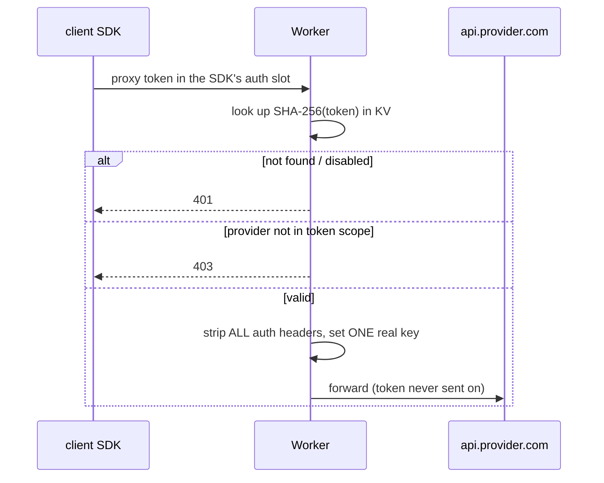

# Proxy token security

## Idea

A proxy token is a shareable, revocable stand-in for a real provider key. The holder puts it in the normal SDK auth slot; the proxy validates it, then swaps in the real key. You can hand someone access without exposing your OpenAI/Anthropic/Gemini key, and revoke it any time.

## Request flow

## The decisions that keep it safe

- **Token rides the SDK's auth slot.** No custom header, no path change. The client only swaps base URL and key. The proxy reads the token from whichever slot routing matched (see [provider-routing-by-auth-header.md](provider-routing-by-auth-header.md)).

- **Strip-all-then-set-one.** Before forwarding, delete *every* inbound auth header (`authorization`, `x-api-key`, `x-goog-api-key`) and set exactly one with the real key (`src/proxy.ts` `swapAuth`). This guarantees the proxy token is never forwarded upstream, even if a client sends it in an unexpected slot. A test asserts the token never appears in any outbound auth header.

- **Hashed at rest.** Tokens are stored as `SHA-256(token)` and shown to the admin exactly once at creation. The KV value never contains the plaintext.

- **Revoke-safe `lastUsed`.** Usage timestamps live in a separate `<hash>:lu` key, not in the token record. Stamping "last used" on a hot path can therefore never recreate or re-enable a record that was deleted or disabled - a revoked token stays revoked.

## Per-token scope

Label, provider scope, enable/disable, revoke, last-used, plus (since v2.1) expiry ([token-expiry-check-at-validate.md](token-expiry-check-at-validate.md)) and rate limiting ([rate-limit-binding-free-and-loose.md](rate-limit-binding-free-and-loose.md)). Spend caps and per-token analytics stay deliberately deferred - the data model leaves room without carrying the weight now.
